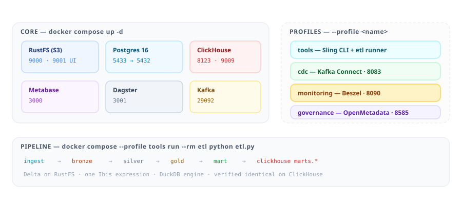

# pondhouse

A lean, fully open-source lakehouse platform. One Ibis expression runs on both
DuckDB (lake) and ClickHouse (serving) — no dbt, no Spark, no ZooKeeper, no paid tiers.

**Requirements:** Docker with Compose v2 (runs great on WSL2), ~6 GB RAM free if you
enable every profile.

## Architecture

<p align="center">
  
</p>

Alongside the batch path above, a CDC path streams changes:
`Debezium → Kafka (KRaft) → Aiven S3 sink → s3://cdc-landing/*.parquet`
(profile `cdc`). Monitoring (Beszel) and catalog/lineage (OpenMetadata) ship as
their own profiles.

### Services and host ports

<p align="center">
  
</p>

## Stack

| Layer | Tool | Version | Profile | Port | URL |
|---|---|---|---|---|---|
| Storage | RustFS (S3) | latest | core | 9000 API / 9001 console | http://localhost:9001 |
| Streaming | Kafka (KRaft) | 4.0.0 | core | 29092 host / 9092 internal | — |
| CDC | Kafka Connect + Debezium + Aiven S3 sink | 3.0 / 3.2.0 | `cdc` | 8083 | REST API |
| Serving | ClickHouse | 25.3 | core | 8123 HTTP / 9009 native | http://localhost:8123/play |
| Viz | Metabase | latest | core | 3000 | http://localhost:3000 |
| Orchestration | Dagster | latest | core | 3001 | http://localhost:3001 |
| Shared DB + demo source | Postgres (wal_level=logical) | 16 | core | 5433 → 5432 (`POSTGRES_HOST_PORT`) | — |
| Batch CLI | Sling | latest | `tools` | — | `docker compose exec sling ...` |
| Medallion ETL | Ibis + DuckDB + deltalake | — | `tools` | — | `docker compose run --rm etl ...` |
| Monitoring | Beszel (hub + agent) | latest | `monitoring` | 8090 | http://localhost:8090 |
| Governance | OpenMetadata + Elasticsearch | 1.13.3 / 9.3.0 | `governance` | 8585 / 8080 | http://localhost:8585 |

## Quickstart

```bash
cd ~/pondhouse

docker compose up -d                       # core: rustfs, kafka, clickhouse, postgres, metabase, dagster
docker compose --profile cdc up -d         # + Kafka Connect (Debezium + Aiven sink)
docker compose --profile tools up -d       # + Sling CLI container
docker compose --profile monitoring up -d  # + Beszel (hub + agent)
docker compose --profile governance up -d  # + OpenMetadata + Elasticsearch
```

All profiles combine freely, e.g. `docker compose --profile cdc --profile monitoring up -d`.

> **First boot order matters:** start the **core stack first** and let Postgres finish
> initializing — its one-shot init script (`orchestration/initdb/01_dbs.sql`) creates the
> `dagster`, `demo`, `openmetadata_db` and `airflow_db` databases. If you enable the
> `governance` profile only *after* the Postgres volume was already initialized, create
> those DBs manually (one-liner in the Governance section below).

## Repo layout

```
pondhouse/
├── docker-compose.yml      # the whole platform (core + 4 profiles)
├── .env                    # all credentials / config knobs (gitignored)
├── docs/                   # architecture / star-schema / services diagrams (SVG)
├── ingestion/sling/        # batch ingestion: connections + replication YAMLs
├── etl/                    # demo medallion ETL: Sling (oltp->bronze) + Ibis (silver/gold/mart)
│   ├── Dockerfile          # the `etl` service image
│   └── tests/              # pytest: transforms, ingest modes, DuckDB↔ClickHouse parity
├── kafka/                  # Connect image (Debezium + Aiven sink) + connector JSONs
├── transformations/        # SQLMesh project (lake=duckdb, serving=clickhouse gateways)
│   ├── models/             # SQL models (bronze/silver/gold)
│   └── examples/           # portable_transform.py — Ibis "one expression, two engines"
├── orchestration/          # Dagster: image, instance config, assets + asset checks
│   └── initdb/             # postgres bootstrap: dagster/demo/openmetadata/airflow DBs
└── serving/initdb/         # ClickHouse bootstrap SQL (creates `marts`)
```

## Configuration (.env)

| Variable | Used by | Default |
|---|---|---|
| `S3_ACCESS_KEY` / `S3_SECRET_KEY` | RustFS, Aiven sink, Sling, DuckDB secret | `pondhouse` / `pondhouse-secret-change-me` |
| `CLICKHOUSE_USER` / `CLICKHOUSE_PASSWORD` / `CLICKHOUSE_DB` | ClickHouse, SQLMesh serving gateway | `default` / `pondhouse` / `marts` |
| `POSTGRES_USER` / `POSTGRES_PASSWORD` / `POSTGRES_DB` | Postgres superuser | `pondhouse` / `pondhouse` / `pondhouse` |
| `BESZEL_AGENT_KEY` | Beszel agent auth | *(paste from Beszel UI)* |
| `OM_VERSION` | OpenMetadata + ingestion image tag | `1.13.3` |

Change the defaults before exposing anything beyond localhost.

## CDC pipeline

Once the `cdc` profile is up, register the connectors:

```bash
curl -X POST http://localhost:8083/connectors -H "Content-Type: application/json" \
  -d @kafka/connectors/debezium-postgres.json   # source: demo DB -> topics demo.*

curl -X POST http://localhost:8083/connectors -H "Content-Type: application/json" \
  -d @kafka/connectors/aiven-s3-sink.json       # sink: topics -> parquet on RustFS

# manage:  curl http://localhost:8083/connectors/<name>/status
#          curl -X DELETE http://localhost:8083/connectors/<name>
```

Flow: Debezium → Kafka topics (`demo.<schema>.<table>`) → Aiven sink →
`s3://cdc-landing/cdc/...parquet` → SQLMesh/DuckDB bronze models.

The bundled Postgres doubles as a demo CDC source (database `demo`, `wal_level=logical`).

## Demo ETL (retail POS: Sling → Ibis → Delta → ClickHouse)

A self-contained retail medallion pipeline in `etl/`, using **Delta** tables on
RustFS and **Ibis** (DuckDB) for all transformations. The gold layer is a star
schema:

<p align="center">
  
</p>

- **`pos`** — retail source in the `demo` DB (`stores`, `products`, `customers`,
  `transactions`, `transaction_items` + `category_ref`/`status_ref`/`country_ref`
  lookups), seeded by `etl/sql/00_init.sql`.
- **`bronze`** — raw **Delta** copy + `_ingested_at` (`etl/bronze.py`), from the Sling
  parquet landing (`pos.*` → `s3://lake/ingestion/{table}.parquet`).
- **`silver`** — **translate** (join lookups → names), **cleanse**, **deduplicate**.
- **`gold`** — star schema (`dim_customer`/`dim_product`/`dim_store`/`dim_date`, `fact_sales`).
- **`mart`** — data marts (`daily_sales_mart`, `product_sales_mart`, `customer_sales_mart`).
- **`marts`** — ClickHouse serving tables (`DeltaLake` engine) created by `etl/serve.py`.

Everything runs in Docker — no local Python needed:

```bash
docker compose up -d postgres rustfs clickhouse createbuckets   # core services

# seed the POS source (once)
docker compose exec -T postgres \
  psql -U pondhouse -d demo -v ON_ERROR_STOP=1 < etl/sql/00_init.sql

# the whole pipeline: ingest -> bronze -> silver/gold/mart -> clickhouse
docker compose --profile tools run --rm etl python etl.py

# add source rows, then re-run
docker compose --profile tools run --rm etl python generate_data.py --rows 5

# tests (44) — includes DuckDB vs ClickHouse parity
docker compose --profile tools run --rm -e CLICKHOUSE_HOST=clickhouse etl \
  python -m pytest tests/ -q
```

Or run it as a **Dagster** asset graph (ingestion → bronze → transform → serve,
with asset checks) from http://localhost:3001, or headless:

```bash
docker compose up -d dagster-webserver dagster-daemon
docker exec -w /opt/dagster -e PYTHONPATH=/opt/dagster \
  pondhouse-dagster-webserver dagster asset materialize --select '*' -m repo.definitions
```

- The **scheduler** (`etl/scheduler.py`, APScheduler) inserts a new POS transaction
  each cycle, then runs the whole pipeline. Cadence is `ETL_SCHEDULE_CRON`.
- Full reference: **`etl/README.md`**. The same `pos` tables can also feed the CDC
  pipeline above.

### Querying the marts (Metabase, DBeaver, any JDBC client)

ClickHouse publishes HTTP on **8123** and the native protocol on **9009**
(container 9000 is remapped because RustFS owns 9000 on the host). DBeaver's
ClickHouse driver uses HTTP, so connect with:

| Setting | Value |
|---|---|
| Host / Port | `localhost` / **8123** |
| Database | `marts` |
| User / Password | `default` / `pondhouse` (`.env`) |

```bash
curl -s 'http://localhost:8123/?user=default&password=pondhouse' \
  --data-binary 'SELECT * FROM marts.daily_sales_mart ORDER BY date_key FORMAT Pretty'
```

## Transformations

```bash
cd transformations
pip install -r requirements.txt
sqlmesh plan                  # lake gateway (DuckDB)
```

- Write SQL models with `dialect: duckdb`, or portable **Ibis** expressions that run
  on both DuckDB (lake) and ClickHouse (serving) — see `examples/portable_transform.py`.
- Before reading S3 from DuckDB, create the secret shown in `transformations/config.yaml`.
- Testing = SQLMesh audits/unit tests + Dagster asset checks (no separate tool).

## Monitoring (Beszel)

One-time key setup:

```bash
docker compose --profile monitoring up -d   # hub on :8090, agent starts after key
```

1. Open http://localhost:8090 → create the admin account.
2. **Add System** → host `host.docker.internal`, port `45876`.
3. Copy the generated **public key** into `.env` as `BESZEL_AGENT_KEY=ssh-ed25519 ...`.
4. `docker compose --profile monitoring up -d` again — the agent connects.

The agent reads per-container Docker stats via the read-only `docker.sock` mount and
host stats via host networking.

## Governance (OpenMetadata)

Integrated in the main compose under the `governance` profile (adapted from the
official OpenMetadata 1.13.3 Postgres compose, wired to the shared Postgres):

```bash
docker compose --profile governance up -d
```

- UI: http://localhost:8585 — login `admin@open-metadata.org` / `admin`
- Airflow (ingestion pipelines): http://localhost:8080 — `admin` / `admin`
- Elasticsearch needs `vm.max_map_count=262144` on the host (one-time):
  `sudo sysctl -w vm.max_map_count=262144`
- First boot takes a few minutes while the `openmetadata-migrate` one-shot runs DB migrations.
- Then add services in the UI for ClickHouse, Metabase, Dagster, Kafka and the
  S3/Delta lake (RustFS) to get catalog + lineage.
- If the Postgres volume was initialized *before* the governance profile existed, create
  OM's databases manually:
  `docker compose exec postgres psql -U pondhouse -f /docker-entrypoint-initdb.d/01_dbs.sql`
- Upgrade via `OM_VERSION` in `.env`.

## DBeaver (and other host clients)

`serving/config.d/listen.xml` sets `listen_host=0.0.0.0` so the published ports
reach the server from the host. Connect DBeaver via HTTP: host `localhost`, port
`8123`, database `marts`, user `default`, password from `.env`
(`CLICKHOUSE_PASSWORD`). Native TCP also available on port `9009`.

## Overlapping components (by design)

- **Dagster vs OM's Airflow** — same category, different scope. The Airflow inside the
  `ingestion` container is OpenMetadata's internal pipeline engine (required by the OM
  server); never add your own DAGs there. Dagster is *your* orchestrator.
- **Dagster vs SQLMesh's built-in scheduler** — don't use SQLMesh's scheduler.
  Rule: *Dagster schedules, SQLMesh executes* (via the `dagster-sqlmesh` integration
  or `sqlmesh run` as Dagster ops).
- **Sling vs Debezium** — complementary: polling-based batch vs log-based CDC.
- **DuckDB vs ClickHouse** — intentional: compute engine vs serving engine.
