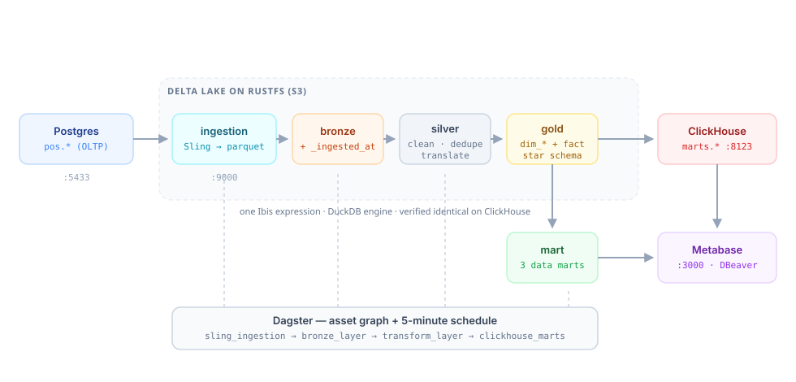
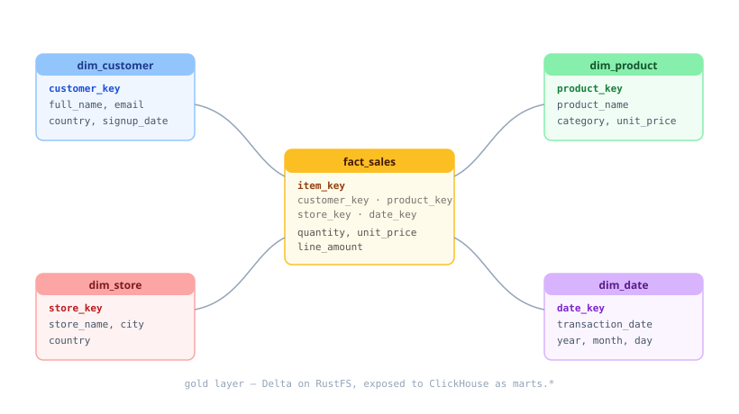

# pondhouse demo ETL — retail POS medallion

A self-contained retail data pipeline on the pondhouse stack: **Delta** tables on
RustFS, all transformations written **once in Ibis** and executed on DuckDB —
then served to ClickHouse for BI tools.

Everything below runs **inside Docker**. No local Python install is required.

<p align="center">
  
</p>

Postgres only holds the POS source (`pos` schema, simulating a POS / SAP HANA
system with coded columns that need translation). Everything downstream is Delta
on RustFS, computed with Ibis, and served to ClickHouse.

## Layers

| Layer | Location | What it is |
|---|---|---|
| `pos` | postgres `demo` | source of truth: `stores`, `products`, `customers`, `transactions`, `transaction_items` + `category_ref`, `status_ref`, `country_ref` |
| `ingestion` | `s3://lake/ingestion/*.parquet` | raw landing (Sling parquet, or custom Delta) |
| `bronze` | `s3://lake/bronze/*` (Delta) | raw copy + `_ingested_at` |
| `silver` | `s3://lake/silver/*` (Delta) | **translate** (join refs → names), **cleanse**, **deduplicate** |
| `gold` | `s3://lake/gold/*` (Delta) | star schema: `dim_customer`, `dim_product`, `dim_store`, `dim_date`, `fact_sales` |
| `mart` | `s3://lake/mart/*` (Delta) | data marts: `daily_sales_mart`, `product_sales_mart`, `customer_sales_mart` |
| `marts` | ClickHouse | serving tables (`DeltaLake` engine) reading gold + mart from RustFS |

### Gold star schema

<p align="center">
  
</p>

## Layout

| File | Purpose |
|---|---|
| `sql/00_init.sql` | `pos` schema: source tables + reference lookups + seed data |
| `generate_data.py` | inserts new POS transactions (manual / scheduler) |
| `ingest.py` | ingestion: Sling (default) or custom Delta ingestion (`overwrite`/`append`/`merge`) |
| `bronze.py` | ingestion → **bronze** Delta (adds `_ingested_at`) |
| `transform.py` | **silver** (translate/cleanse/dedup) → **gold** (fact+dim) → **mart** |
| `serve.py` | creates ClickHouse `marts` tables over the Delta gold + mart layers |
| `etl.py` | orchestrator: `ingest → bronze → transform → serve` (`--init` seeds) |
| `scheduler.py` | APScheduler cron: each cycle generates data + runs the ETL |
| `conn.py` | Ibis/DuckDB connection helper (S3 Delta, optional Postgres attach) |
| `config.py` | Postgres + RustFS + cron config (env-overridable) |
| `Dockerfile` | the `etl` image used by `docker compose run --rm etl ...` |
| `tests/` | pytest suite (transforms, ingest modes, db helpers, backend parity) |

## Run it (Docker)

From the repository root. Step 0 is needed once; the rest is the pipeline.

```bash
# 0. core stack + buckets
docker compose up -d postgres rustfs clickhouse createbuckets

# 1. seed the POS source
docker compose exec -T postgres \
  psql -U pondhouse -d demo -v ON_ERROR_STOP=1 < etl/sql/00_init.sql

# 2. ingestion: postgres -> s3://lake/ingestion/*.parquet
docker compose --profile tools up -d sling
docker compose --profile tools exec -T sling \
  sling run --home-dir /sling -r /sling/replications/demo-to-lake.yaml

# 3. bronze -> silver -> gold -> mart  (Delta on RustFS, computed with Ibis)
docker compose --profile tools run --rm etl python bronze.py
docker compose --profile tools run --rm etl python transform.py

# 4. expose gold + mart to ClickHouse
docker compose --profile tools run --rm etl python serve.py
```

Steps 2–4 in one shot:

```bash
docker compose --profile tools run --rm etl python etl.py
```

`etl.py` picks the ingestion method automatically (`--ingest auto`, the default):
Sling when the docker CLI is reachable — which is the case on the host — and the
equivalent Ibis/DuckDB ingestion inside the container, where there is no docker
socket. Force one with `--ingest sling` or `--ingest custom`.

Add more source rows and re-run at any time:

```bash
docker compose --profile tools run --rm etl python generate_data.py --rows 5
```

> The `etl` service joins the compose network, so it reaches the other services by
> name (`postgres`, `rustfs`, `clickhouse`). Running the scripts from your host
> instead requires `S3_ENDPOINT=http://localhost:9000` and `POSTGRES_PORT=5433`.

## Ingestion modes

`ingest.py --method custom --mode {overwrite,append,merge}` writes the source to a
Delta `ingestion` layer:

- **overwrite** — replace the ingestion Delta table (default)
- **append** — append new rows (no dedup; re-running duplicates rows)
- **merge** — upsert on the table's primary key, so re-runs are idempotent

```bash
docker compose --profile tools run --rm etl python ingest.py --method custom --mode merge
```

## Querying the result

ClickHouse serves the gold + mart layers as `marts.*`:

```bash
curl -s 'http://localhost:8123/?user=default&password=pondhouse' \
  --data-binary 'SELECT * FROM marts.daily_sales_mart ORDER BY date_key FORMAT Pretty'
```

### DBeaver / any JDBC client

The ClickHouse HTTP port is published on the host, so a local client connects with:

| Setting | Value |
|---|---|
| Driver | ClickHouse |
| Host | `localhost` |
| Port | **8123** (HTTP — the default for DBeaver's driver) |
| Database | `marts` |
| User | `default` |
| Password | `pondhouse` (from `.env`) |

The native protocol is also published on **9009** (mapped from the container's
9000, because RustFS already uses 9000 on the host). Use 8123 unless your client
specifically needs the native driver. Metabase reaches ClickHouse in-network at
`clickhouse:8123`.

Postgres is published on **5433** by default (`POSTGRES_HOST_PORT` in `.env`) so
it does not collide with another local Postgres.

## Tests

```bash
docker compose --profile tools run --rm etl python -m pytest tests/ -q
```

The suite covers the silver/gold/mart logic, the ingestion write modes, the
psycopg2 helpers, and **backend parity**: the same Ibis expressions are executed
on DuckDB *and* ClickHouse and the results compared row-for-row. The ClickHouse
tests skip automatically when no server is reachable, so they are CI-safe.

To include them, point the tests at the running ClickHouse:

```bash
docker compose --profile tools run --rm -e CLICKHOUSE_HOST=clickhouse etl \
  python -m pytest tests/ -q
```

## Scheduler

`scheduler.py` uses APScheduler. Each cycle inserts a random POS transaction, then
runs the full ETL. Cadence is a 5-field cron in `ETL_SCHEDULE_CRON` (default
`*/5 * * * *`). In production, prefer the Dagster schedule (`orchestration/`),
which materializes the same steps as an asset graph.

## Config

All knobs are env vars with defaults matching `../.env`:

| Variable | Default | Used by |
|---|---|---|
| `POSTGRES_HOST` / `POSTGRES_PORT` | `localhost` / `5432` | source postgres |
| `POSTGRES_HOST_PORT` | `5433` | host port mapping (compose only) |
| `ETL_DB` | `demo` | source database |
| `POSTGRES_USER` / `POSTGRES_PASSWORD` | `pondhouse` | postgres auth |
| `ETL_ATTACH_PG` | `0` | attach Postgres to DuckDB (only ingestion needs it) |
| `S3_ACCESS_KEY` / `S3_SECRET_KEY` | `pondhouse` / `pondhouse-secret-change-me` | RustFS auth |
| `S3_ENDPOINT` | `http://localhost:9000` | RustFS endpoint (`http://rustfs:9000` in-network) |
| `S3_LAKE_BUCKET` | `lake` | lake bucket |
| `CLICKHOUSE_HOST` / `CLICKHOUSE_PORT` | `localhost` / `8123` | serve step |
| `CLICKHOUSE_USER` / `CLICKHOUSE_PASSWORD` | `default` / `pondhouse` | ClickHouse auth |
| `ETL_SCHEDULE_CRON` | `*/5 * * * *` | scheduler cadence |

## Notes on correctness

- **Overwrites are vacuumed.** A Delta overwrite only tombstones the previous data
  files; they stay in the bucket. ClickHouse's `DeltaLake` engine reads the parquet
  files it finds rather than replaying the transaction log, so stale files from an
  earlier run with a different schema made it fail with *"Reading from files with
  different schema is not possible"*. `write_delta` now vacuums after each write.
- **`_ingested_at` is batch-level.** `ibis.now()` is transaction-constant, so every
  row of a given run shares one load timestamp — intended for a batch load stamp.
- **Only ingestion touches Postgres.** The lake steps run with no Postgres attach,
  so bronze/silver/gold/mart still work when the source database is down.
